# 🛒 Retail SQL Business Case Study

SQL-focused retail analytics case study that answers **35 business questions** on a multi-store relational database using **JOINs, CTEs, window functions**, and related techniques, with a light **Python** layer for KPI charts.

---

## 📌 Project Overview

This project models a multi-store retail business across Saudi cities (Riyadh, Jeddah, Dammam, Khobar, Madinah, Makkah) with customers, products, orders, order lines, payments, employees, and stores.

The goal is to solve real business questions **in SQL** — the skill most often tested in Data Analyst interviews — rather than only building dashboards.

**SQL is the core.** Python is used only for a quick KPI snapshot and summary charts.

---

## 🛠️ Tools & Technologies

- **SQL (MySQL)** – Schema design, data loading, and all analysis queries
- **Python** – Optional KPI snapshot and visualization
- **Pandas & NumPy** – Data manipulation
- **Matplotlib & Seaborn** – Summary charts
- **Git & GitHub** – Version control and project showcase

---

## ✨ Key Features

- Relational schema with 7 related tables
- 35 business questions from basics to advanced SQL
- JOINs, GROUP BY, HAVING, CASE, subqueries, CTEs
- Window functions (RANK, running totals, YoY-style comparisons)
- Revenue, customer, store, and product analysis
- Light Python KPI charts for portfolio visuals

---

## 📈 Key Insights

- Revenue concentrates in specific stores, regions, and categories
- Top customers and employees can be ranked with clear SQL logic
- Discount bands and payment methods show distinct sales patterns
- Repeat vs one-time customers are measurable with CTEs
- Return rates and day-of-week performance vary by store
- Monthly trends and rankings support operational decisions

---

## 📁 Project Structure

```
Retail-SQL-Business-Case-Study/
├── data/
│   ├── stores.csv
│   ├── products.csv
│   ├── customers.csv
│   ├── employees.csv
│   ├── orders.csv
│   ├── order_items.csv
│   └── payments.csv
├── sql/
│   ├── 01_schema_and_load.sql
│   └── 02_analysis_queries.sql
├── python/
│   ├── 01_kpi_charts.py
│   └── charts/
├── docs/
│   └── Questions_Index.md
├── images/
│   ├── sql/
│   └── python/
├── requirements.txt
└── README.md
```

---

## 🚀 How to Run the Project

### 1. SQL Analysis (MySQL)
- Create the database and tables using `sql/01_schema_and_load.sql`
- Import all CSVs from `data/` into the matching tables
- Run the analysis queries from `sql/02_analysis_queries.sql`
- Question index: `docs/Questions_Index.md`

### 2. Python KPI Charts (Optional)
```bash
pip install -r requirements.txt
python python/01_kpi_charts.py
```

---

## 📊 SQL Question Categories

| Level | Topics | Examples |
|-------|--------|----------|
| Basics | Filter, DISTINCT | Completed orders, categories |
| Aggregations | SUM, AVG, GROUP BY | Revenue, AOV, status counts |
| Joins | Multi-table analysis | Customers, stores, employees |
| HAVING / CASE | Business rules | High-revenue categories, discount bands |
| Subqueries / CTEs | Structured logic | Unsold products, monthly trend |
| Window functions | Ranking & trends | Store rank, running revenue, YoY |
| Scenarios | KPIs & behavior | Return rate, best day, cross-category buyers |

---

## 🖼️ Screenshots

### SQL Analysis
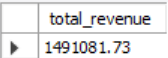
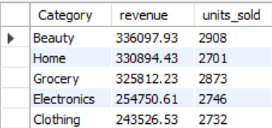
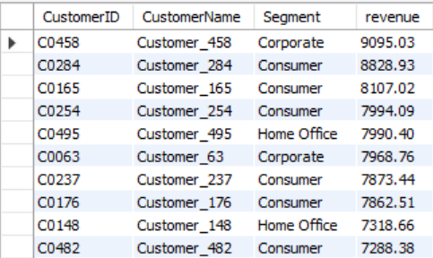
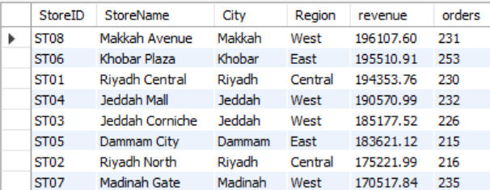
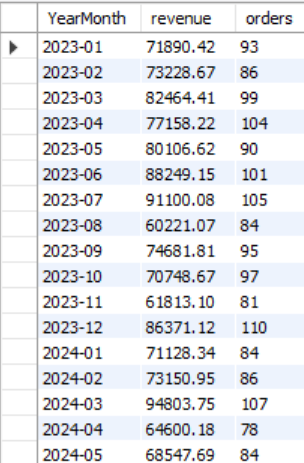
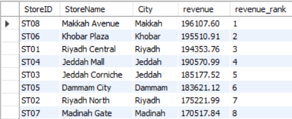
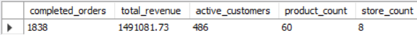

### Python Visualizations
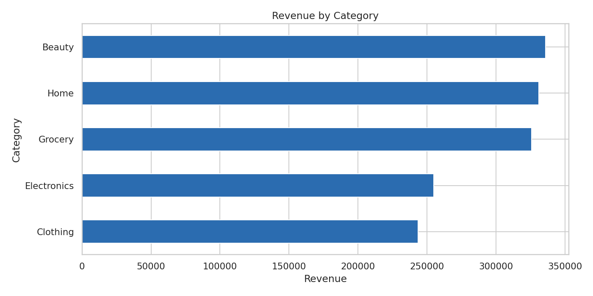
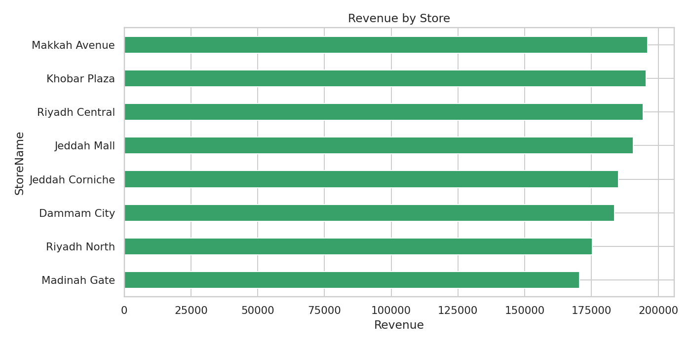
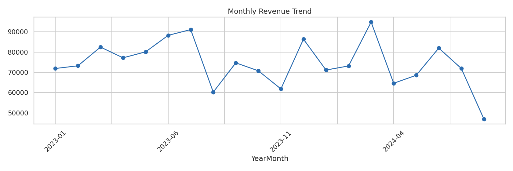
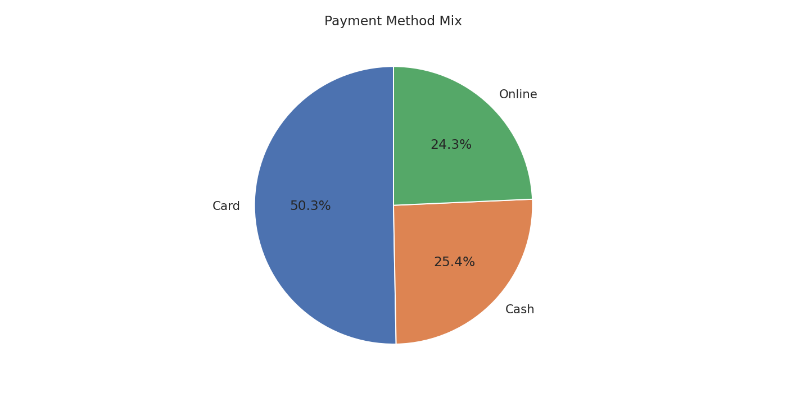
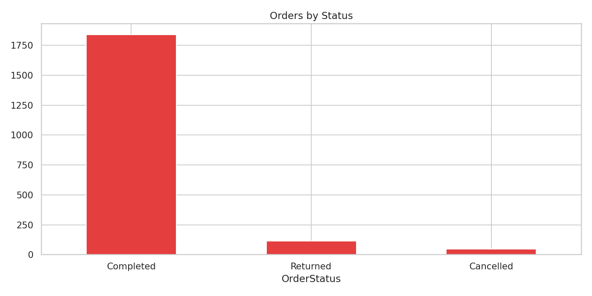

---

## 👤 Author

**Mubeen Salman**  
Aspiring Data Analyst  

- LinkedIn: [https://www.linkedin.com/in/mubeen-salman-459776364/]  
- GitHub: [https://github.com/MuhammadMubeen04]  

---

## 📄 License

This project is for educational and portfolio purposes.
